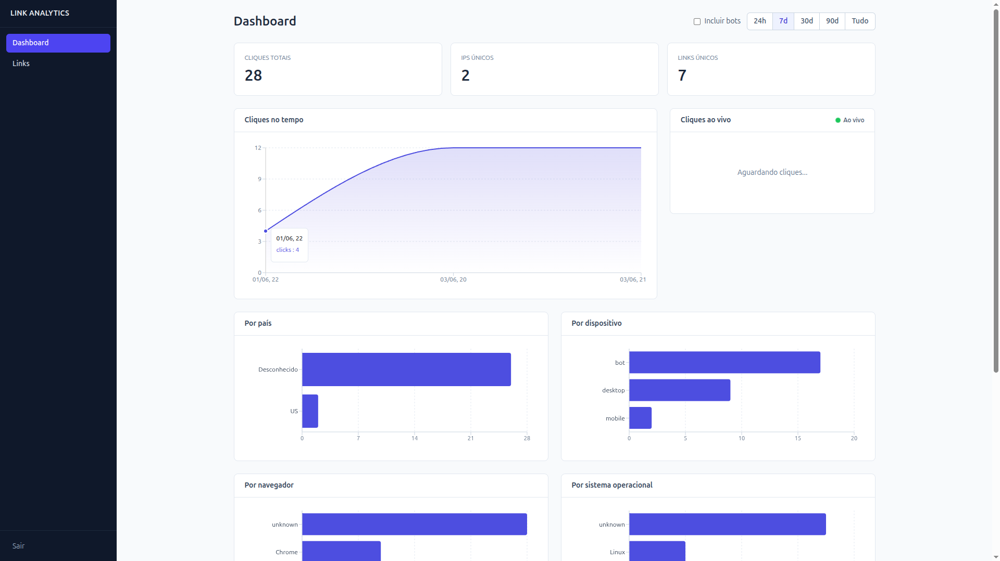
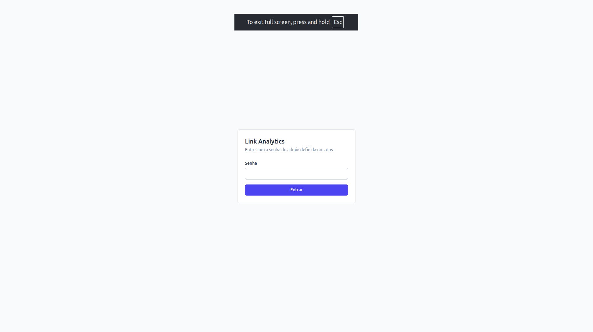
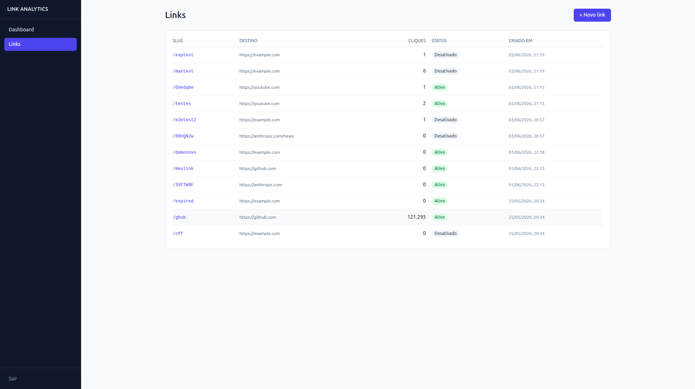
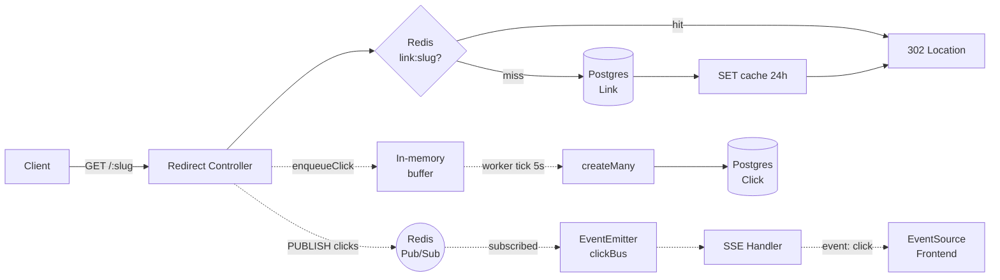

# Link Analytics

Encurtador de URLs **self-hosted** com painel de analytics em tempo real. O foco do projeto **não é a ideia** (encurtador é commodity) — é a **engenharia por trás**: redirect com latência baixa via cache, agregações no Postgres, e dashboard que atualiza ao vivo conforme cliques chegam.

> **Diferencial técnico:** redirect com **p50 abaixo de 50ms** usando Redis como cache de `slug → URL original`. **Live feed via Redis Pub/Sub + SSE** propaga cada clique pra dashboards conectados em sub-segundo.



---

## Visão geral

- **Open source, single-user, self-hosted.** Você clona, define uma senha de admin no `.env` e roda na sua própria infra.
- Não há cadastro de usuários — todas as URLs do sistema pertencem ao admin. Login serve apenas pra proteger o painel.
- Stack: **Node 20 + TypeScript + Express + PostgreSQL + Prisma + Redis + React + Recharts**, tudo orquestrado via **Docker Compose**.

Para o escopo completo, decisões arquiteturais e roadmap pós-MVP, ver [docs/SCOPE.md](docs/SCOPE.md).

---

## Demonstração

| Login | Lista de links |
|---|---|
|  |  |

---

## Highlights de engenharia

| Decisão | Onde mora | Por quê |
|---|---|---|
| **Cache Redis com TTL sliding 24h** | [api/src/features/redirect/redirect.service.ts](api/src/features/redirect/redirect.service.ts) | Garante o p50 <50ms (ver Performance) |
| **`GETEX` atômico (GET + EXPIRE em 1 round-trip)** | [api/src/features/redirect/redirect.service.ts](api/src/features/redirect/redirect.service.ts) | Renova TTL sem race condition |
| **Click logging assíncrono (buffer + worker periódico)** | [api/src/features/clicks/clicks.worker.ts](api/src/features/clicks/clicks.worker.ts) | Redirect não bloqueia em I/O de banco |
| **Sync de counters Redis → Postgres com `DECRBY`** | [api/src/features/clicks/clicks.worker.ts](api/src/features/clicks/clicks.worker.ts) | Tolera concorrência — não usa `SET 0` |
| **Detecção de bots em 3 camadas (ua-parser + UA vazio + regex)** | [api/src/lib/ua-parser.ts](api/src/lib/ua-parser.ts) | Filtra ~99% das requisições automatizadas |
| **Enrichment GeoIP + UA na hora do enqueue (não no flush)** | [api/src/features/clicks/clicks.service.ts](api/src/features/clicks/clicks.service.ts) | Distribui CPU em vez de spike a cada flush |
| **Validação anti-SSRF (bloqueia loopback + RFC 1918)** | [api/src/features/links/links.schemas.ts](api/src/features/links/links.schemas.ts) | Impede admin de criar link apontando pra serviço interno |
| **Comparação de senha com `timingSafeEqual`** | [api/src/features/auth/auth.service.ts](api/src/features/auth/auth.service.ts) | Evita timing attack na senha admin |
| **Trust proxy configurável** | [api/src/config/env.ts](api/src/config/env.ts) | Funciona em loopback (dev), Docker bridge (compose), Cloudflare (prod) |
| **Error handler centralizado (Zod, Prisma, SyntaxError)** | [api/src/middleware/error-handler.ts](api/src/middleware/error-handler.ts) | Controllers ficam sem `try/catch` repetido |
| **Cache invalidation correta em PATCH de slug** | [api/src/features/links/links.service.ts](api/src/features/links/links.service.ts) | DEL no slug antigo E no novo — evita zombie |
| **Real-time via Redis Pub/Sub + EventEmitter compartilhado** | [api/src/config/redis-pubsub.ts](api/src/config/redis-pubsub.ts) | 1 conexão Redis serve N admins SSE |
| **SSE com heartbeat de 15s + cleanup em `req.on('close')`** | [api/src/features/analytics/analytics.sse.ts](api/src/features/analytics/analytics.sse.ts) | Detecta conexões mortas, evita listener leak |
| **Auth via query-param dedicado pro SSE** | [api/src/features/auth/auth.middleware.ts](api/src/features/auth/auth.middleware.ts) | `EventSource` não aceita custom headers |
| **Graceful shutdown (flush final do buffer)** | [api/src/server.ts](api/src/server.ts) | Não perde cliques no `docker compose down` |
| **8 queries de analytics em paralelo (`Promise.all`)** | [api/src/features/analytics/analytics.service.ts](api/src/features/analytics/analytics.service.ts) | Overview agregado em ~70ms total |
| **Time series com `DATE_TRUNC` parametrizado** | [api/src/features/analytics/analytics.service.ts](api/src/features/analytics/analytics.service.ts) | Bucket dinâmico (hora/dia) por range |
| **49 testes backend + 10 frontend (Vitest + supertest + jsdom)** | [api/tests/](api/tests/), [web/src/lib/](web/src/lib/) | Cobertura de lógica crítica (UA parsing, anti-SSRF, JWT, storage) |

---

## Arquitetura



**Hot path** (linhas sólidas) = redirect síncrono, otimizado pra latência. **Cold paths** (pontilhadas) = logging assíncrono e broadcast, isolados do hot path.

---

## Stack

| Camada | Tecnologia | Por quê |
|---|---|---|
| Runtime | Node.js 20 + TypeScript | LTS estável + tipos end-to-end |
| Servidor | Express 5 | Mature, async-aware error handling |
| Banco | PostgreSQL 16 + Prisma 6 | Type-safe queries + migrations versionadas |
| Cache | Redis 7 (ioredis) | Pub/Sub embutido + GETEX atômico |
| Frontend | React 19 + Vite 8 + Tailwind v4 | Stack moderna sem PostCSS legacy |
| Charts | Recharts 3 | Composable, sem D3 imperativo |
| Forms | react-hook-form | Validação client-side ergonômica |
| Real-time | Server-Sent Events (SSE) | HTTP-based, atravessa proxy, reconexão nativa |
| Auth | JWT (jsonwebtoken) | Stateless, single-admin self-hosted |
| Validação | Zod 4 | Schema-first, type inference |
| Deploy | Docker Compose | Postgres + Redis + API em um comando |

---

## Como rodar localmente

### Pré-requisitos
- Docker e Docker Compose
- Node.js 20+

### Passo a passo

```bash
# 1. Clone
git clone https://github.com/<seu-usuario>/link-analytics.git
cd link-analytics

# 2. Configure o .env
cp .env.example .env
# Edite .env e defina ADMIN_PASSWORD, JWT_SECRET e senhas do Postgres.
# Para gerar um JWT_SECRET seguro:
#   openssl rand -base64 32

# 3. Sobe Postgres + Redis + API (tudo)
docker compose up -d --build

# 4. Roda as migrations + seed inicial (3 links de exemplo)
cd api
npm install
npm run prisma:migrate -- --name init
npm run db:seed

# 5. Frontend (em outro terminal)
cd ../web
cp .env.example .env
npm install
npm run dev
```

API em `http://localhost:3000`, dashboard em `http://localhost:5173`.

**Senha padrão de teste:** definida no `.env` (`ADMIN_PASSWORD`).

---

## Estrutura

```
link-analytics/
├── api/                       # backend Express + Prisma
│   ├── prisma/                # schema + migrations + seed
│   └── src/
│       ├── config/            # env, prisma, redis, pubsub
│       ├── features/          # auth, links, redirect, clicks, analytics, health
│       ├── lib/               # geoip, ua-parser, slug-generator, time-range
│       └── middleware/        # error-handler
├── web/                       # frontend React + Vite + Tailwind
│   └── src/
│       ├── pages/             # LoginPage, DashboardPage, LinksListPage, LinkDetailPage
│       ├── components/        # ui, layout, charts, LiveClickFeed
│       ├── hooks/             # useAuth, useAnalytics, useLinks, useLinkDetail, useClickStream
│       └── lib/               # api, auth, format
├── docs/                      # SCOPE.md + screenshots
├── docker-compose.yml         # postgres + redis + api
├── .env.example
└── README.md
```

---

## Endpoints

### Públicos
| Método | Rota | Função |
|---|---|---|
| `GET` | `/:slug` | Redirect 302 (ou 410 se expirado/desativado/max-clicks) |
| `GET` | `/health` | Healthcheck JSON `{postgres, redis}` |

### Admin (JWT no header)
| Método | Rota | Função |
|---|---|---|
| `POST` | `/admin/login` | Recebe senha, devolve JWT |
| `POST` | `/admin/links` | Cria link (slug auto ou custom) |
| `GET` | `/admin/links` | Lista paginada |
| `GET` | `/admin/links/:id` | Detalhe do link |
| `PATCH` | `/admin/links/:id` | Edita (URL, slug, expiração, status) |
| `DELETE` | `/admin/links/:id` | Soft delete |
| `GET` | `/admin/analytics/overview` | Dashboard global agregado |
| `GET` | `/admin/analytics/links/:id` | Analytics agregado por link |
| `GET` | `/admin/analytics/stream?token=…` | SSE com cliques em tempo real |

**Query params** dos endpoints de analytics agregados:
- `range` — `24h` / `7d` (default) / `30d` / `90d` / `all`
- `includeBots` — `false` (default) / `true`

### Formato de erro

Todos os endpoints `/admin/*` retornam erros no formato:

```json
{ "error": { "message": "string", "code": "string?", "details": "any?" } }
```

Códigos atuais: `VALIDATION_ERROR` (400), `UNAUTHORIZED` (401), `NOT_FOUND` (404), `CONFLICT` (409), `INVALID_JSON` (400). O endpoint público `/:slug` devolve texto puro (404 / 410) já que o consumidor é navegador.

---

## Uso da API (curl)

```bash
# Login → token
TOKEN=$(curl -s -X POST http://localhost:3000/admin/login \
  -H "Content-Type: application/json" \
  -d '{"password":"sua-senha-do-env"}' | jq -r .token)

# Criar link com slug auto-gerado
curl -X POST http://localhost:3000/admin/links \
  -H "Authorization: Bearer $TOKEN" \
  -H "Content-Type: application/json" \
  -d '{"originalUrl":"https://anthropic.com"}'

# Criar com slug custom, expiração e limite
curl -X POST http://localhost:3000/admin/links \
  -H "Authorization: Bearer $TOKEN" \
  -H "Content-Type: application/json" \
  -d '{
    "originalUrl":"https://anthropic.com",
    "slug":"claude",
    "expiresAt":"2027-01-01T00:00:00Z",
    "maxClicks":100
  }'

# Listar com paginação
curl "http://localhost:3000/admin/links?limit=20&offset=0" \
  -H "Authorization: Bearer $TOKEN"

# Editar (PATCH parcial — só envia o que muda)
curl -X PATCH http://localhost:3000/admin/links/<id> \
  -H "Authorization: Bearer $TOKEN" \
  -H "Content-Type: application/json" \
  -d '{"originalUrl":"https://example.com"}'

# Desativar (soft delete — active=false, click history preservada)
curl -X DELETE http://localhost:3000/admin/links/<id> \
  -H "Authorization: Bearer $TOKEN"

# Analytics global (últimos 7 dias, sem bots)
curl "http://localhost:3000/admin/analytics/overview?range=7d" \
  -H "Authorization: Bearer $TOKEN"

# SSE — cliques ao vivo (note: token vai na query, não no header)
curl -N "http://localhost:3000/admin/analytics/stream?token=$TOKEN"
```

---

## Performance

Benchmark do endpoint público `/:slug` com cache aquecido.

| Cenário | p50 | p75 | p99 | Throughput |
|---|---|---|---|---|
| Cache hit (100 conexões concorrentes) | **47.60ms** | 49.13ms | 241ms¹ | 2012 req/s |
| Cache miss (single user, 10 amostras) | ~3.5ms | — | — | — |

Bench: `wrk -t4 -c100 -d30s --latency` rodando em localhost contra API single-threaded em Docker Compose.

¹ A cauda p99 corresponde aos ticks de 5s do worker assíncrono que persiste cliques em lote (`prisma.click.createMany`). Trade-off conhecido — ver [docs/SCOPE.md](docs/SCOPE.md) para o roadmap pós-MVP de migração para Redis list + consumer.

### Pipeline assíncrono — integridade
- 60.417 requests no bench
- 60.755 cliques registrados no banco (inclui warmups + testes anteriores)
- **Zero perda** sob carga sustentada

---

## Testes

**59 testes** cobrindo lógica crítica do backend e do frontend.

### Backend (`api/`) — 49 testes

```bash
cd api
npm test              # roda tudo (unit + integration)
npm run test:unit     # só unit
npm run test:integration   # só HTTP via supertest (precisa do compose up)
npm run test:watch    # watch mode pra dev
```

**Cobertura (unit, 41 testes):**
- `lib/ua-parser` — detecção de bots, fallbacks seguros, browsers reais não viram falso positivo
- `lib/slug-generator` — alfabeto sem ambíguos, 7 chars, sem colisão em 1k tentativas
- `lib/time-range` — buckets corretos por preset (hour/day), `to` sempre "agora"
- `lib/geoip` — strip IPv4-mapped IPv6, null para IPs privados
- `features/links/links.schemas` — anti-SSRF (loopback + RFC 1918), validação de slug/maxClicks/expiresAt
- `features/auth/auth.service` — JWT roundtrip, `verifyPassword` com inputs adversariais

**Integração (8 testes) — `tests/integration/`:**
- `GET /health` retorna 200 com Postgres + Redis OK
- `POST /admin/login` cobre todos os cenários (200, 400, 401)
- `GET /admin/links` exige Bearer válido

### Frontend (`web/`) — 10 testes

```bash
cd web
npm test
```

**Cobertura:**
- `lib/format` — formatadores pt-BR, `truncateMiddle` preservando começo/fim
- `lib/auth` — storage do token com key namespaced, roundtrip set/get/clear

### Stack de testes

- **Vitest 4** — fast, native ESM, TypeScript built-in
- **supertest** — HTTP integration testing sem subir servidor real
- **jsdom** — DOM environment pros testes do `localStorage` no frontend

---

## Roadmap

- [x] Fase 1 — Setup (Express + Postgres + Prisma + Redis + Docker Compose)
- [x] Fase 2 — Endpoint público `/:slug` com cache Redis + click logging assíncrono
- [x] Fase 3 — Auth admin (JWT) + CRUD de links
- [x] Fase 4 — Endpoints de analytics agregados
- [x] Fase 5 — Dashboard React + Recharts
- [x] Fase 6 — SSE de cliques em tempo real
- [x] Fase 7 — Testes (unit + integração) + polimento do README

---

## Licença

MIT
